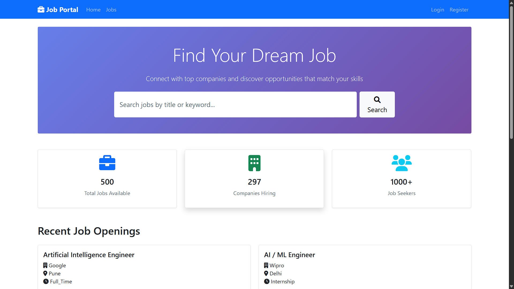
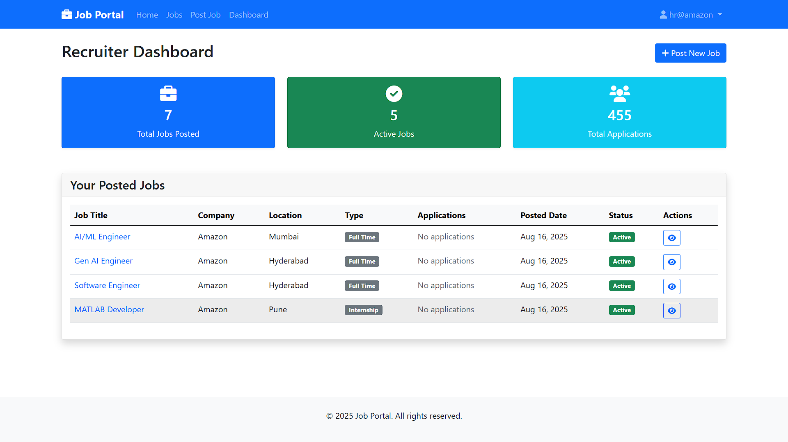
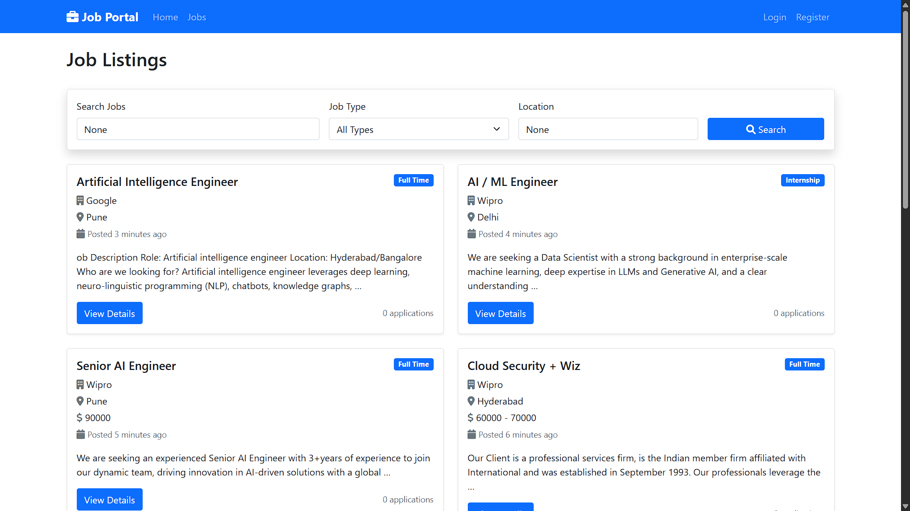

# 🏢 Job Board - Hiring Platform

 A fully functional Job Portal Application built with Django. Connect talent with opportunities seamlessly!.           
This project allows Recruiters to post jobs and manage applications, while Job Seekers can browse, search, and apply for jobs with ease.



## ✨ Features
### For Job Seekers 👨‍💻
- 🔍 Smart Job Search - Find jobs by title, location, and type
- 📝 Easy Applications - Apply with resume and cover letter
- 🎯 Personalized Dashboard - Track your applications
- 📱 Mobile Responsive - Apply on-the-go
### For Recruiters👨‍💼
- ➕ Post Jobs - Create detailed job listings
- 👥 Manage Applications - View and organize candidate applications
- 📊 Analytics Dashboard - Track job performance and applications
- 💌 Direct Contact - Connect with candidates instantly
### Technical Features 🛠️
- 🔐 Secure Authentication - Role-based user system
- 🎨 Modern UI/UX - Clean, professional Bootstrap design
- 📱 Fully Responsive - Works perfectly on all devices
- 🔒 CSRF Protection - Secure forms and data handling
- 🚫 Duplicate Prevention - No duplicate job applications

## 📂 Project Structure
```bash
jobhub-django/
├── job_portal/          # Main project settings
│   ├── asgi.py          # WSGI entry point
│   ├── settings.py      # Project settings
│   ├── urls.py          # Root URL configuration
│   └── wsgi.py          # WSGI entry point for web servers
│
├── jobs/                # Jobs app
│   ├── models.py        # Database models
│   ├── views.py         # Business logic
│   ├── forms.py         # Form handling
│   ├── urls.py          # URL routing
│   ├── admin.py         # Admin site configuration
│   ├── apps.py          # App configuration
│   ├── static/              # CSS, JS, images
│   └── templates/           # HTML templates
│       ├── base.html        # Base layout
│       ├── home.html        # Landing page
│       ├── jobs/            # Job-related templates
│       └── registration/    # Auth templates
├── manage.py            # Django management
├── README.md
└── requirements.txt     # Dependencies
```
## ⚡ Getting Started
#### 1️⃣ Clone the Repository
```bash
git clone https://github.com/Shabeenabd/jobboard-django.git
cd jobboard-django
```
#### 2️⃣ Create Virtual Environment & Install Dependencies
```bash
python -m venv venv
venv\Scripts\activate   # On Windows
source venv/bin/activate # On Mac/Linux

pip install -r requirements.txt
```
#### 3️⃣ Apply Migrations
```bash
python manage.py makemigrations
python manage.py migrate
```
#### 4️⃣ Create Superuser
```bash
python manage.py createsuperuser
```
#### 5️⃣ Run the Development Server
```bash
python manage.py runserver
```
Open your browser
`http://localhost:8000`

## 🔑 Environment Variables
Create a .env file in the root and add:
```bash
SECRET_KEY=your_django_secret_key
DEBUG=True
```
## App Demo 📸

<table>
  <tr>
    <td></td>
    <td></td>
  </tr>
  <tr>
    <td></td>
    <td></td>
  </tr>
</table>

## 🛠️ Tech Stack

- Backend: Django 
- Frontend: Django Templates, Bootstrap/CSS
- Database: SQLite 
- Authentication: Django Auth system

## 💡 Inspiration

JobHub was built as a simple yet powerful project to explore Django’s potential in building real-world applications. It aims to make recruitment easier and smarter by bringing recruiters and job seekers to a single platform.


